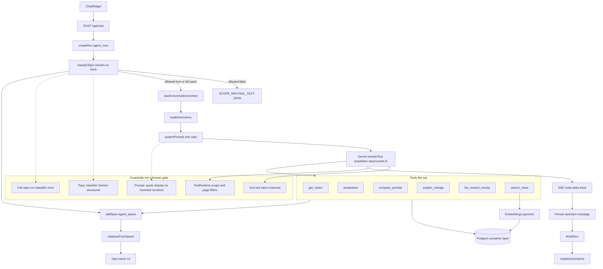
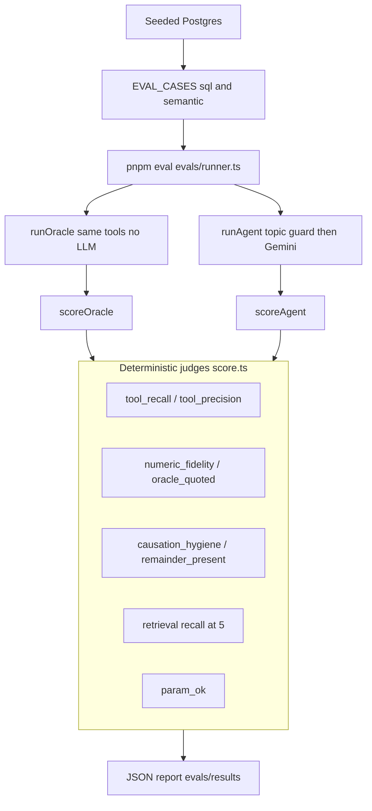
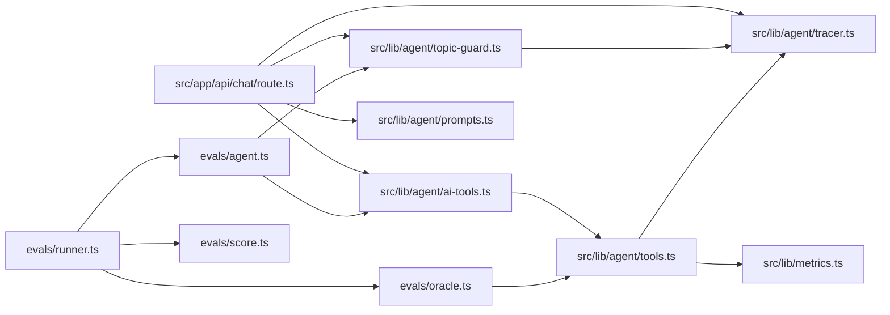

# Sales diagnostics agent — architecture

Gemini analyst via the Vercel AI SDK tool loop (max 8 steps), with a pre-analyst Gemini topic classifier (allow/refuse, fail-open on error). No multi-agent handoffs and no human-approval gate; guardrails are the topic gate, prompt rules, Zod tool schemas, and offline eval scorers.

## 1. Runtime workflow

Chat UI posts to `/api/chat`, which creates a traced run, then classifies the topic with a small Gemini call (no tools). Out-of-scope messages get a fixed refusal JSON response; in-scope (or classifier fail-open) builds context + system prompt and runs the analyst Gemini with six Postgres-backed tools. Soft rules live in the prompt; hard structure is Zod + page scope plus the topic gate. Spans feed citations and the ops UI; there is no approval step before the reply streams.

## 2. Evals pipeline

Seeded DB is ground truth. Each case runs an oracle (deterministic tools) and optionally the live agent; `runAgent` applies the same topic guard before the analyst. `scope_guard` cases cover refuse (storyteller/weather) and allow (rain overlapping a sales drop). Scorers are rule-based, not LLM-as-judge. Flags: `--skip-agent`, `--type`, `--scenario`, `--id`.

## 3. Component map

Runtime and evals share the same topic guard, tool implementations, and metric SQL layer; the eval runner swaps in oracle vs agent and scores both offline.
